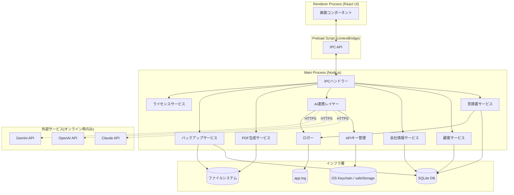

# 01. システム全体アーキテクチャ

> 関連: [要件定義 v0.3](../requirements.md) / [目次](./README.md)

## 変更履歴
| 日付 | 内容 |
|---|---|
| 2026-07-17 | 初版作成 |
| 2026-07-17 | 専用リポジトリ管理への変更に伴い、モノレポ前提の記載を削除 |

---

## リポジトリ方針

本プロジェクトは販売する独立製品であるため、既存の `yuppi314/my-tool`(九星気学×マヤ暦 診断ツール)とは切り離し、**MITSU専用の新規リポジトリ**として管理します。以降の設計はすべてMITSU単体プロジェクトを前提とします(ディレクトリ構成の詳細は [03. ディレクトリ構成](./03-directory-structure.md))。

---

## 1. 全体方針

- **ローカルファースト**: サーバーを持たない。全データはユーザーのPC内で完結する
- **AIはオプション拡張**: AI機能(入力補助)が使えなくても、他の全機能は動作する(要件定義の必須原則)
- **外部通信はAI APIのみ**: それ以外の通信は一切発生しない(オフライン動作の担保)
- **セキュリティ**: Electronの推奨構成(`contextIsolation: true` / `nodeIntegration: false`)を採用し、Rendererから直接ファイルシステム・DB・ネットワークにはアクセスさせない

## 2. レイヤー構成

| レイヤー | 役割 | 主な技術 |
|---|---|---|
| Presentation | 画面表示・ユーザー操作 | React (Renderer Process) |
| IPC Bridge | Renderer⇔Main間の安全な橋渡し | Preload Script (contextBridge) |
| Application | ビジネスロジック・サービス | Main Process (Node.js / TypeScript) |
| Infrastructure | 永続化・外部通信 | SQLite / ファイルシステム / OS Keychain / 外部AI API |

## 3. コンポーネント図

## 4. 設計原則の反映ポイント

- **AI非依存性**: `AILayer` はMain Process内の1コンポーネントに過ぎず、`QuoteService` など他サービスから独立している。AILayerが失敗・未設定でも `QuoteService` 経由の手入力フローは影響を受けない
- **セキュリティ境界**: RendererはPreload経由でIPCのみ呼び出せる。DB・ファイル・APIキー・外部通信への直接アクセス手段を持たない
- **拡張性**: AI連携レイヤーはプロバイダー(Claude/OpenAI/Gemini)を抽象化しており(詳細は[09](./09-ai-integration.md))、将来の運営提供API方式にも同じ構造で対応できる
- **単一プロセス・単一ユーザー前提**: サーバーやマルチユーザー同時アクセスを考慮しない、デスクトップアプリとしてシンプルな構成に留める(MVP優先)
