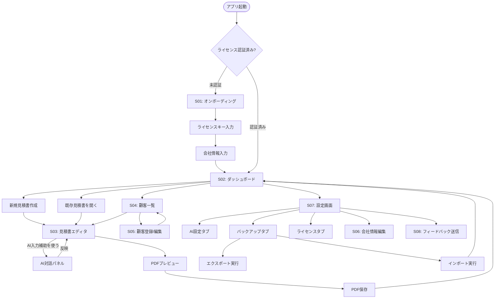

# 05. 画面遷移図

> 関連: [要件定義 v0.3](../requirements.md) / [目次](./README.md) / [画面一覧](./04-screens.md)

## 変更履歴
| 日付 | 内容 |
|---|---|
| 2026-07-17 | 初版作成 |

---

## 全体遷移図

## 補足

- 「AI対話パネル」は独立画面ではなく、見積書エディタ(S03)内に常駐するサブコンポーネントとして扱う(要件定義の「AIなしでも完結」原則により、パネルを閉じても本体フローが完結できる設計)
- オンボーディングはライセンス未認証時のみ強制表示され、認証済みなら以降はスキップされダッシュボードへ直行する
- バックアップのインポート完了後は必ずダッシュボードに戻り、データが反映された状態を確認できるようにする
