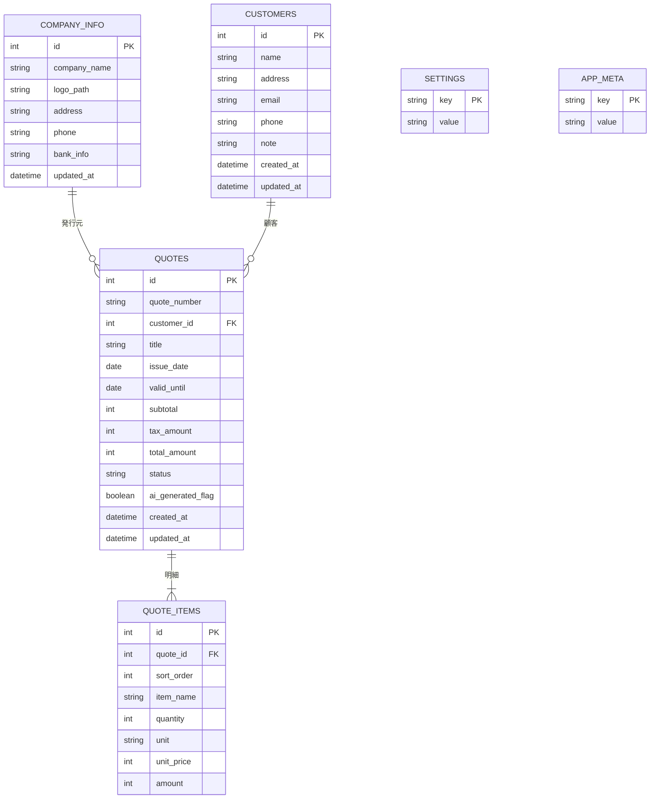

# 08. データベース設計

> 関連: [要件定義 v0.3](../requirements.md) / [目次](./README.md)

## 変更履歴
| 日付 | 内容 |
|---|---|
| 2026-07-17 | 初版作成 |

---

## 方針

- SQLite 1ファイルにアプリの全データを保存(サーバー不要、オフライン完結)
- APIキーそのものはDBに保存しない([12. APIキー管理設計](./12-api-key-management.md)参照。DBにはプロバイダー名と「設定済みか」のフラグのみ)
- スキーマ変更に備え `app_meta` にバージョンを持たせ、起動時にマイグレーションを適用する([後方互換性のための設計])

## ER図

## テーブル補足

| テーブル | 補足 |
|---|---|
| `company_info` | 1行のみ運用(自社は1社の前提)。ロゴは`logo_path`で画像ファイルパスを参照 |
| `customers` | 顧客の登録・編集・検索対象 |
| `quotes` | `quote_number`は年+連番方式(例: `Q-2026-0001`)、UNIQUE制約+トランザクション採番で重複防止 |
| `quote_items` | `sort_order`で表示順を保持し、ドラッグ並び替え等の将来拡張に対応 |
| `settings` | Key-Value形式。`ai_provider`(claude/openai/gemini)、`ai_key_configured`(true/false)、`license_status`等を保持。**APIキーそのものは持たない** |
| `app_meta` | `schema_version`を保持し、起動時のマイグレーション判定に使用 |

## マイグレーション方針

1. 起動時に`app_meta.schema_version`を確認
2. アプリが期待するバージョンより古ければ、`db/migrations/`内の未適用SQLを順番に実行
3. 実行後、`schema_version`を更新
4. 万一マイグレーション失敗時は起動を中断し、[14. エラーハンドリング設計](./14-error-handling.md)の「DB破損」ルートに従いバックアップからの復元を案内する
