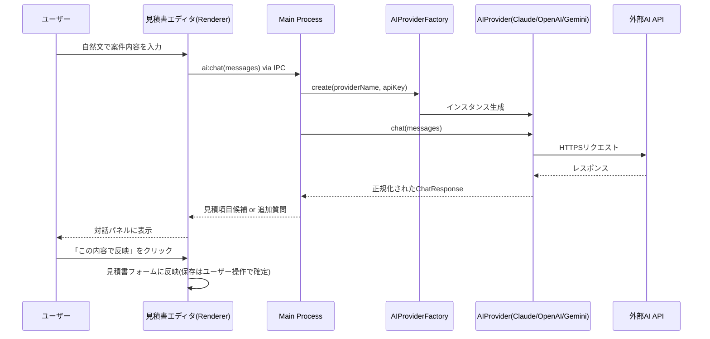

# 09. AI連携レイヤー設計

> 関連: [要件定義 v0.3](../requirements.md) / [APIキー管理設計](./12-api-key-management.md) / [目次](./README.md)

## 変更履歴
| 日付 | 内容 |
|---|---|
| 2026-07-17 | 初版作成 |

---

## 設計方針(要件定義8番: マルチAIプロバイダー対応)

AIプロバイダー(Claude/OpenAI/Gemini)とAPIキー提供元(ユーザー自身/将来の運営提供)の2軸を分離し、アプリ本体は具体的なプロバイダーを意識しない設計にします。

## 共通インターフェース(イメージ)

```ts
interface ChatMessage {
  role: 'user' | 'assistant';
  content: string;
}

interface QuoteItemSuggestion {
  itemName: string;
  quantity: number;
  unitPrice: number;
}

interface ChatResponse {
  // AIが追加で確認したいことがある場合
  followUpQuestion?: string;
  // AIが見積項目を組み立てられた場合
  suggestedItems?: QuoteItemSuggestion[];
}

interface AIProvider {
  readonly name: 'claude' | 'openai' | 'gemini';
  chat(messages: ChatMessage[]): Promise<ChatResponse>;
}
```

`AIProviderFactory.create(providerName, apiKey)` が設定内容に応じて `ClaudeProvider` / `OpenAIProvider` / `GeminiProvider` のいずれかを生成します。将来プロバイダーを追加する際は、このインターフェースを実装したクラスを1つ追加するだけで済みます。

## 対話フロー(コアUXフロー実装)

1. ユーザーが見積書エディタのAIパネルに自然文を入力(例: 「A社のサイト制作、デザイン15万、コーディング10万で見積もりたい」)
2. Main Processが会話履歴+システムプロンプト(見積項目を抽出するよう指示)をAIProviderに渡す
3. AIが「不足情報について聞き返す」か「見積項目候補」のいずれかを返す
4. 聞き返しがあれば対話を継続、候補が返れば画面にプレビュー表示
5. ユーザーが「この内容で反映」を押すと、見積書フォームの品目一覧に反映される(自動保存はせず、必ずユーザーの最終確認を挟む)



## エラーハンドリング

AIProviderは以下を判別し、共通の`AIError`型でMain Processに通知します。UIには「何が起きたか・次に何をすればよいか」を平易な言葉で表示します([14. エラーハンドリング設計](./14-error-handling.md)参照)。

| 状態 | UIでの案内 |
|---|---|
| APIキー未設定 | 「AI機能を使うには設定画面でAPIキーを登録してください」+ 手入力導線 |
| APIキー無効 | 「登録されているAPIキーが無効です。設定画面をご確認ください」 |
| レート制限 | 「AIの利用上限に達しました。しばらく待ってから再度お試しください」 |
| ネットワーク不通 | 「AIサービスに接続できません。手入力でも見積書は作成できます」 |

## 拡張時の手順(将来のプロバイダー追加・運営提供API対応)

1. `AIProvider`インターフェースを実装した新規クラスを`ai/`配下に追加
2. `AIProviderFactory`に分岐を追加
3. 設定画面のプロバイダー選択肢にUIを追加
4. 「運営提供API」方式を追加する場合は、キー取得元を`user`/`operator`で切り替えるだけで済むよう`keyStoreService`側で吸収する(APIキー自体はプロバイダーに渡す直前まで同じ扱い)
