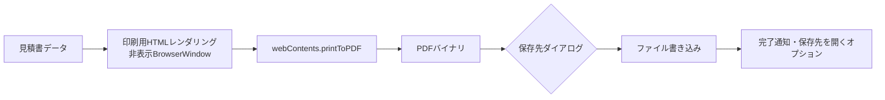

# 10. PDF生成設計

> 関連: [技術スタック選定](./02-tech-stack.md) / [目次](./README.md)

## 変更履歴
| 日付 | 内容 |
|---|---|
| 2026-07-17 | 初版作成 |

---

## 方式

Electronの`webContents.printToPDF`を利用し、追加ライブラリなしでPDF生成を完結させます([02. 技術スタック選定](./02-tech-stack.md)参照)。

1. 見積書データをReactコンポーネントで印刷用HTML/CSSにレンダリング
2. 非表示の`BrowserWindow`でそのHTMLを読み込む
3. `webContents.printToPDF()`でPDFバイナリを生成
4. ユーザーが指定した保存先にファイル書き込み

## レイアウト方針

- 印刷用スタイルはCSSの`@media print`で定義し、画面表示用スタイルと分離する
- 将来のテンプレート追加(将来機能)に備え、レイアウトのHTML構造とデータ(見積書の中身)を分離した設計にする(テンプレート差し替えが用意になる)

## ファイル名規則

`見積書_{顧客名}_{見積書番号}_{発行日}.pdf`
(ファイル名に使えない記号は自動的に除去・置換する)

## エラー時の扱い

書き込み失敗(権限不足・ディスク容量不足等)の場合は[14. エラーハンドリング設計](./14-error-handling.md)の「ファイルI/Oエラー」ルートに従い、再試行/キャンセルのダイアログを表示します。
