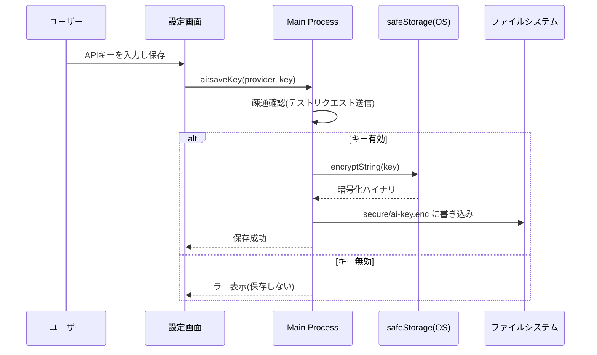

# 12. APIキー管理設計

> 関連: [AI連携レイヤー設計](./09-ai-integration.md) / [セキュリティ要件(要件定義13番)](../requirements.md) / [目次](./README.md)

## 変更履歴
| 日付 | 内容 |
|---|---|
| 2026-07-17 | 初版作成 |

---

## 方針

Version 0.1はBYOK(ユーザー自身のAPIキー)方式のため、キーの安全な保管が特に重要です。Electron標準の`safeStorage`モジュール(Windows: DPAPI、Mac: Keychain)を利用し、自前の暗号化実装を避けます([02. 技術スタック選定](./02-tech-stack.md)参照)。

## 保存先

- 暗号化済みバイナリ: ユーザーデータフォルダ内 `secure/ai-key.enc`
- **DBには保存しない**。DBの`settings`テーブルには「プロバイダー名」「キー設定済みフラグ」のみを保持する([08. データベース設計](./08-database.md)参照)

## 保存フロー(保存時に疎通確認を行う)

## 読み出しフロー

- 起動時には復号しない(メモリに常時保持しない)
- AI機能を実際に利用するタイミングで都度 `safeStorage.decryptString()` により復号し、AI呼び出しが終わればメモリ上の参照を破棄する

## 削除

設定画面の「削除」操作で `secure/ai-key.enc` を削除する。削除後、AI入力補助は自動的に無効表示([06. ワイヤーフレーム](./06-wireframes.md)の未設定時表示)に切り替わる。

## ログとの関係

[15. ログ設計](./15-logging.md)と連動し、APIキーの値そのものはログに一切出力しません(マスキング必須)。
