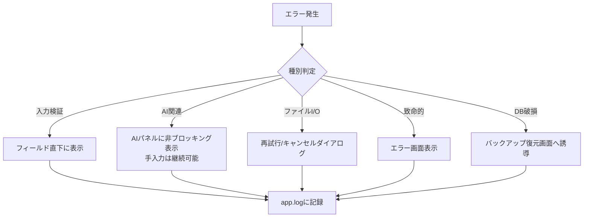

# 14. エラーハンドリング設計

> 関連: [UI/UX設計](./07-ui-ux.md) / [ログ設計](./15-logging.md) / [目次](./README.md)

## 変更履歴
| 日付 | 内容 |
|---|---|
| 2026-07-17 | 初版作成 |

---

## 共通方針

すべてのエラーはログに記録しつつ、ユーザーには「何が起きて、次に何をすればよいか」を平易な言葉で提示します。スタックトレースや技術的なエラーコードをそのまま見せません。

## エラー分類

| # | 種別 | 例 | 表示方法 | ブロックするか |
|---|---|---|---|---|
| 1 | 入力バリデーションエラー | 必須項目未入力、数値形式不正 | 該当フィールド直下にインライン表示 | 保存操作のみブロック |
| 2 | AI関連エラー | キー未設定/無効、レート制限、ネットワーク不通 | AIパネル内に非ブロッキング表示 | ブロックしない(手入力は継続可能) |
| 3 | ファイルI/Oエラー | PDF保存失敗、バックアップ書き込み失敗 | ダイアログで再試行/キャンセル | 該当操作のみ |
| 4 | 致命的エラー | 予期しない例外・クラッシュ | エラー画面+ログ出力+再起動導線 | アプリ全体 |
| 5 | DB破損 | 起動時のDBアクセス不能 | バックアップからの復元画面へ誘導 | アプリ全体 |

## 分類・ルーティング図

## 実装方針

- Renderer側: Reactの`ErrorBoundary`で予期しないUI例外をキャッチし、致命的エラー画面へ遷移
- Main側: `process.on('uncaughtException')` / `process.on('unhandledRejection')` でキャッチしログ出力。可能な範囲でアプリの継続を試み、継続不可能な場合はユーザーに保存前データがあれば警告した上で終了する
- AI関連エラーは[09. AI連携レイヤー設計](./09-ai-integration.md)で定義した`AIError`型を通じて分類済みの状態でUIに渡す
