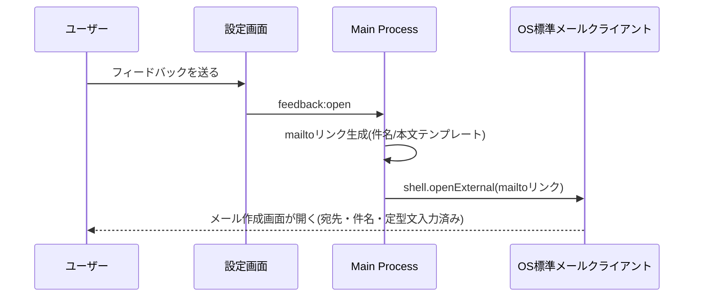

# 16. フィードバック送信設計

> 関連: [設定画面設計](./13-settings-screen.md) / [目次](./README.md)

## 変更履歴
| 日付 | 内容 |
|---|---|
| 2026-07-17 | 初版作成 |

---

## 方針(MVP: メール送信で対応)

専用のフィードバック受信バックエンドは作らず、OS標準のメールクライアントを起動する方式とします(シンプルさ優先、ユーザーからの合意事項)。

## フロー

設定画面(S07)の「フィードバックを送る」ボタン押下で、以下を自動入力したメール作成画面を開きます。

- 宛先: サポート用メールアドレス(固定値)
- 件名: `[MITSU フィードバック] v{アプリバージョン}`
- 本文: OS種別・アプリバージョン・ライセンス状態(有無のみ)を自動挿入したテンプレート。ユーザーが自由記述欄に内容を追記する

## 補足

- ログファイルの自動添付は行いません(OSごとのメールクライアント差異が大きく複雑になるため)。代わりに「ログファイルの場所はこちら」というリンク(フォルダを開く)を案内に留めます
- 将来(Version 0.2以降): アプリ内フォーム+自社サーバーでの受信に切り替える案を検討します
