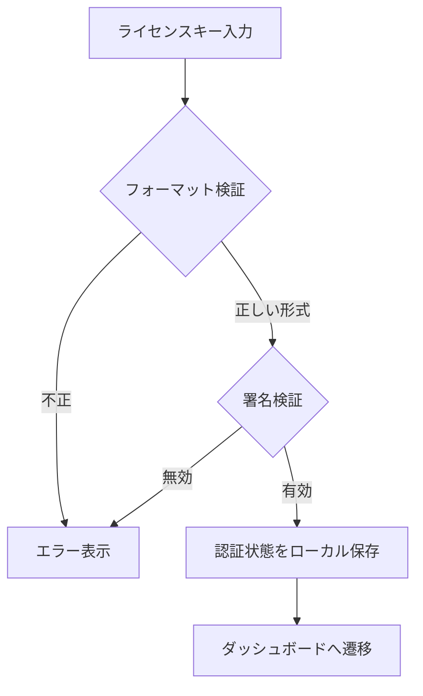

# 17. ライセンス認証設計(Version 0.1 簡易版)

> 関連: [販売戦略(要件定義15番)](../requirements.md) / [目次](./README.md)

## 変更履歴
| 日付 | 内容 |
|---|---|
| 2026-07-17 | 初版作成 |

---

## 方針

BYOK方式・オフライン動作原則と一貫性を持たせ、**サーバーなしで完結するオフラインライセンス方式**とします。

## ライセンスキー形式

`MITSU-XXXXX-XXXXX-XXXXX-XXXXX`(英数字)

## 検証方式

- 販売時に、社内用のライセンスキー生成ツール(別途用意)で「シリアル+署名(HMAC等)」形式のキーを発行する
- アプリ内には検証用の鍵情報のみを埋め込み、入力されたキーの署名を検証する(サーバー通信なしで完結)
- 認証状態はローカルに保存する(改ざん防止のため、[12. APIキー管理設計](./12-api-key-management.md)と同様に`safeStorage`での保護、または簡易な整合性チェック値の付与を行う)

## フロー

## 「簡易版」であることの明記

この方式はオフラインで完結する代わりに、リバースエンジニアリングされた場合のキー生成防止までは保証しません。Version 0.1では「善意のユーザーの誤操作・誤用の防止」レベルの簡易保護と割り切ります。意図的なクラック行為への耐性を高める場合は、将来オンライン認証(アクティベーションサーバー+端末バインド)への強化を検討します。

## 未認証時の挙動

オンボーディング画面(S01)でブロックし、ライセンス認証が完了するまで基本機能は利用できません(体験版・トライアル運用が必要になった場合は将来別途検討します)。
