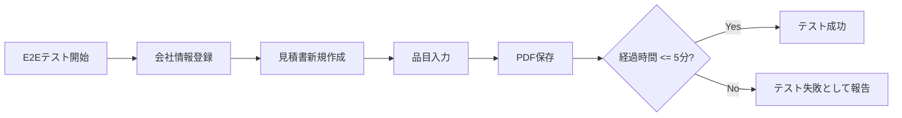

# 18. テスト設計

> 関連: [成功条件(要件定義16番)](../requirements.md) / [技術スタック選定](./02-tech-stack.md) / [目次](./README.md)

## 変更履歴
| 日付 | 内容 |
|---|---|
| 2026-07-17 | 初版作成 |

---

## テスト方針

品質を機能追加より優先する開発方針のもと、各層で以下のテストを組み合わせます。

## 単体テスト(Vitest)

| 対象 | 内容 |
|---|---|
| 金額計算 | 小計・消費税・合計の計算ロジック(端数処理含む) |
| 見積書番号採番 | 年+連番方式の重複防止ロジック |
| AIProvider各実装 | 外部APIはモック化し、レスポンス正規化ロジックを検証 |
| DBマイグレーション | バージョン間の移行処理 |
| ライセンスキー検証 | フォーマット・署名検証ロジック |

## 統合テスト

- IPCハンドラー経由でのDB CRUD(見積書作成・顧客登録等)
- バックアップのエクスポート→インポートの往復テスト(データが完全に復元されるか)

## E2Eテスト(Playwright, Electron対応)

- **成功条件の自動検証**: 「初回起動→会社情報登録→見積書作成→PDF保存」までの一連のシナリオを実行し、経過時間を計測して5分以内に完了することをアサーションする(要件定義16番)
- AI入力補助あり/なし、両方のフローをテスト(AIは外部APIをモックサーバーに差し替える)
- バックアップ/復元の一連の操作

## 手動QAチェックリスト

- ペルソナB(ITリテラシー低め)を想定したユーザビリティテスト
- Windows/Mac両OSでの表示崩れ確認
- APIキー未設定状態での全基本機能の動作確認(AI非依存原則の検証)

## 成功条件の検証方法まとめ

## CIについて

Version 0.1ではローカルでのテスト実行を必須とし、GitHub Actions等のCI導入は保守方針([14. 保守方針(要件定義)]参照)に応じて追って検討します(MVP優先、インフラ構築は後回し)。
